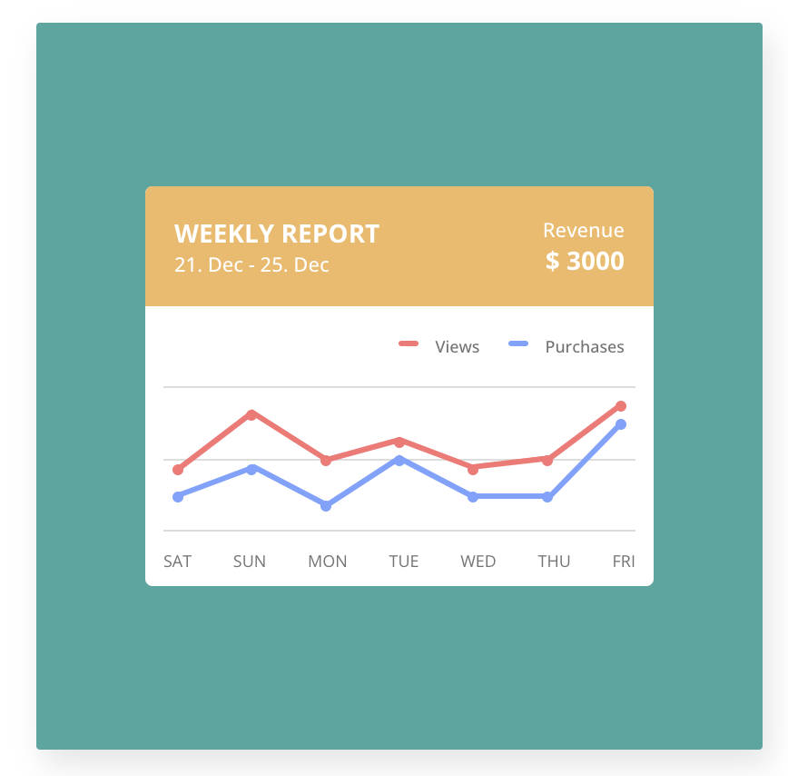

# 100daysCSS
  <table>
    <thead>
      <tr>
        <th>Day</th>
        <th>link</th>
        <th>Title</th>
        <th></th>
        <th>Day</th>
        <th>link</th>
        <th>Title</th>
      </tr>
    </thead>
  <tbody>
      <tr>
        <td>1</td>
        <td> <a href="#1">link</a></td>
        <td><code>100 DAYS CSS</code></td>
        <td></td>
        <td>11</td>
        <td> <a href="#11">link</a></td>
        <td><code>WALKING BOOTS</code></td>
      </tr>
      <tr>
        <td>2</td>
        <td> <a href="#2">link</a></td>
        <td><code>MENU ICON</code></td>
        <td></td>
        <td>12</td>
        <td><a href="#12">link</a></td>
        <td><code>TOOLTIP</code></td>
      </tr>
      <tr>
        <td>3</td>
        <td> <a href="#3">link</a></td>
        <td><code>THE PYRAMID</code></td>
        <td></td>
        <td>13</td>
        <td><a href="#13">link</a></td>
        <td><code>USER GALLERY</code></td>
      </tr>
      <tr>
        <td>4</td>
        <td> <a href="#4">link</a></td>
        <td><code>THE LOADING</code></td>
        <td></td>
        <td>14</td>
        <td><a href="#14">link</a></td>
        <td><code>BYCICLOPTER</code></td>
      </tr>
      <tr>
        <td>5</td>
        <td> <a href="#5">link</a></td>
        <td><code>STATISTICS</code></td>
        <td></td>
        <td>15</td>
        <td><a href="#15">link</a></td>
        <td><code>UPLOAD</code></td>
      </tr>
      <tr>
        <td>6</td>
        <td> <a href="#6">link</a></td>
        <td><code>PROFILE</code></td>
        <td></td>
        <td>16</td>
        <td><a href="#16">link</a></td>
        <td><code>BLOBBY</code></td>
      </tr>
      <tr>
        <td>7</td>
        <td> <a href="#7">link</a></td>
        <td><code>NOTIFICATIONS</code></td>
        <td></td>
        <td>17</td>
        <td><a href="#17">link</a></td>
        <td><code>PENROSE TRIANGLE</code></td>
      </tr>
      <tr>
        <td>8</td>
        <td> <a href="#8">link</a></td>
        <td><code>METABALLS</code></td>
        <td></td>
        <td>18</td>
        <td><a href="#18">link</a></td>
        <td><code>ELASTIC</code></td>
      </tr>
      <tr>
        <td>9</td>
        <td> <a href="#9">link</a></td>
        <td><code>RAINY NIGHT</code></td>
        <td></td>
        <td>19</td>
        <td><a href="#19">link</a></td>
        <td><code>SLIDER WITH RADIO BUTTON</code></td>
      </tr>
      <tr>
        <td>10</td>
        <td> <a href="#10">link</a></td>
        <td><code>WATCH</code></td>
        <td></td>
        <td>20</td>
        <td><a href="#20">link</a></td>
        <td><code>SEND EMAIL</code></td>
      </tr>
  </tbody>
  </table>

<table>
    <thead>
      <tr>
        <th>Day</th>
        <th>link</th>
        <th>Title</th>
        <th></th>
        <th>Day</th>
        <th>link</th>
        <th>Title</th>
      </tr>
    </thead>
  <tbody>
      <tr>
        <td>21</td>
        <td> <a href="#21">link</a></td>
        <td><code>PACMAN</code></td>
        <td></td>
        <td>31</td>
        <td> <a href="#31">link</a></td>
        <td><code>PENDULUM WAVE</code></td>
      </tr>
      <tr>
        <td>22</td>
        <td> <a href="#22">link</a></td>
        <td><code>FITNESS TRACKER</code></td>
        <td></td>
        <td>12</td>
        <td><a href="#12">link</a></td>
        <td><code>TOOLTIP</code></td>
      </tr>
      <tr>
        <td>32</td>
        <td> <a href="#32">link</a></td>
        <td><code>COUNTER</code></td>
        <td></td>
        <td>13</td>
        <td><a href="#13">link</a></td>
        <td><code>USER GALLERY</code></td>
      </tr>
      <tr>
        <td>24</td>
        <td> <a href="#24">link</a></td>
        <td><code>BUTTON</code></td>
        <td></td>
        <td>34</td>
        <td><a href="#34">link</a></td>
        <td><code>HELLO</code></td>
      </tr>
      <tr>
        <td>25</td>
        <td> <a href="#25">link</a></td>
        <td><code>MAP MARKER</code></td>
        <td></td>
        <td>35</td>
        <td><a href="#35">link</a></td>
        <td><code>LOADING CIRCLE</code></td>
      </tr>
      <tr>
        <td>26</td>
        <td> <a href="#26">link</a></td>
        <td><code>MOTIVATIONAL MODAL</code></td>
        <td></td>
        <td>36</td>
        <td><a href="#36">link</a></td>
        <td><code>TABS</code></td>
      </tr>
      <tr>
        <td>27</td>
        <td> <a href="#27">link</a></td>
        <td><code>CHECKLIST</code></td>
        <td></td>
        <td>37</td>
        <td><a href="#37">link</a></td>
        <td><code>CAROUSEL</code></td>
      </tr>
      <tr>
        <td>28</td>
        <td> <a href="#28">link</a></td>
        <td><code>RING RING</code></td>
        <td></td>
        <td>38</td>
        <td><a href="#38">link</a></td>
        <td><code>LOGO TRANSITION</code></td>
      </tr>
      <tr>
        <td>29</td>
        <td> <a href="#29">link</a></td>
        <td><code>SEARCH FIELD</code></td>
        <td></td>
        <td>39</td>
        <td><a href="#39">link</a></td>
        <td><code>MENU TOGGLE</code></td>
      </tr>
      <tr>
        <td>30</td>
        <td> <a href="#30">link</a></td>
        <td><code>RANDOM LINE</code></td>
        <td></td>
        <td>40</td>
        <td><a href="#40">link</a></td>
        <td><code>GALLERY</code></td>
      </tr>
  </tbody>
  </table>

<table>
    <thead>
      <tr>
        <th>Day</th>
        <th>link</th>
        <th>Title</th>
        <th></th>
        <th>Day</th>
        <th>link</th>
        <th>Title</th>
      </tr>
    </thead>
  <tbody>
      <tr>
        <td>41</td>
        <td> <a href="#41">link</a></td>
        <td><code>ERROR MODAL</code></td>
        <td></td>
        <td>51</td>
        <td><a href="#51">link</a></td>
        <td><code>CSS COUNTER</code></td>
      </tr>
      <tr>
      <td>42</td>
      <td> <a href="#42">link</a></td>
      <td><code>STARS</code></td>
      <td></td>
      <td>52</td>
      <td> <a href="#52">link</a></td>
      <td><code>DOT WAVE</code></td>
      <td></td>
      </tr>
      <tr>
      <td>43</td>
      <td> <a href="#43">link</a></td>
      <td><code>LIGHTBULB</code></td>
      <td></td>
      <td>53</td>
      <td> <a href="#53">link</a></td>
      <td><code> RANGE SLIDER</code></td>
      <td></td>
      </tr>
      <tr>
      <td>44</td>
      <td> <a href="#44">link</a></td>
      <td><code>TWISTED PYRAMID</code></td>
      <td></td>
      <td>54</td>
      <td><a href="#54">link</a></td>
      <td><code> WAVES</code></td>
      </tr>
      <tr>
      <td>45</td>
      <td> <a href="#45">link</a></td>
      <td><code>BUTTON</code></td>
      <td></td>
      <td>55</td>
      <td><a href="#55">link</a></td>
      <td><code> THERMOSTAT</code></td>
      </tr>
      <tr>
      <td>46</td>
      <td> <a href="#46">link</a></td>
      <td><code>IRIS CIRCLES</code></td>
      <td></td>
      <td>56</td>
      <td><a href="#56">link</a></td>
      <td><code> FLOWER</code></td>
      </tr>
      <tr>
      <td>47</td>
      <td><a href="#47">link</a></td>
      <td><code>PIXEL ART</code></td>
      <td></td>
      <td>57</td>
      <td><a href="#57">link</a></td>
      <td><code> ICOSAHEDRON</code></td>
      </tr>
      <tr>
      <td>48</td>
      <td> <a href="#48">link</a></td>
      <td><code>3D CUBE</code></td>
      <td></td>
      </tr>
      <tr>
      <td>49</td>
      <td> <a href="#49">link</a></td>
      <td><code>CSS FOLLOW</code></td>
      <td></td>
      </tr>
      <tr>
      <td>50</td>
      <td> <a href="#50">link</a></td>
      <td><code>EASTER EGG</code></td>
      <td></td>
      </tr>
  </tbody>
  </table>

      

<h1 id=1> # 1 - 100 DAYS CSS</h1>

An easy start into the challenge with a custom build number with gradient.

Code: [StackBlitz](https://stackblitz.com/edit/web-platform-1gpnrn?file=styles.css)
    

<h1 id=2> # 2 - MENU ICON</h1>

Used on almost every website by now, simple but impressively animated it becomes a real eye-catcher

Code: [StackBlitz](https://stackblitz.com/edit/web-platform-q7sjme?file=index.html,styles.css)
    

<h1 id=3> # 3 - THE PYRAMID</h1>

Not as challenging as the real pyramids in Egypt, but the shadow path is not easy.

Code: [StackBlitz](https://stackblitz.com/edit/web-platform-mha5fv?file=styles.css)
    

<h1 id=4> # 4 - THE LOADING</h1>

The best are always websites that do not need a loading status. If they do, here would be a calming one.

Code: [StackBlitz](https://stackblitz.com/edit/web-platform-vwwfeu?file=index.html)
    

<h1 id=5> # 5 - STATISTICS</h1>

In a world of numbers, it is important to be able to inter   pret them correctly. Beautiful statistics help to capture these data.

Code: [StackBlitz](https://stackblitz.com/edit/web-platform-7syiqs?file=styles.css,index.html)
    

<h1 id=6> # 6 - PROFILE</h1>

Who of you knows how many social media profiles you have already created? For a refreshing twist, you can also create one yourself.

Code: [StackBlitz](https://stackblitz.com/edit/web-platform-dpkzjx?file=index.html,styles.css)
    

<h1 id=7> # 7 - NOTIFICATIONS</h1>

The three cornerstones of any application? Brought together in the smallest possible space.

Code: [StackBlitz](https://stackblitz.com/edit/web-platform-xhssrn?file=styles.css,index.html)
    

<h1 id=8> # 8 - METABALLS</h1>

At first glance impossible to implement with CSS, but filters make this possible too.

Code: [StackBlitz](https://stackblitz.com/edit/web-platform-i1arie?file=index.html,styles.css)
    

<h1 id=9> # 9 - RAINY NIGHT</h1>

The perfect time of day and the perfect weather to program in peace. The raindrops even shatter on the ground.

Code: [StackBlitz](https://stackblitz.com/edit/web-platform-lqyqej?file=index.html)
    

<h1 id=10> # 10 - WATCH</h1>

Classic, noble, modern or playful? What do you want your favorite watch to look like?

Code: [StackBlitz](https://stackblitz.com/edit/web-platform-aqhndf?file=index.html,styles.css)
    

<h1 id=11> # 11 - WALKING BOOTS</h1>

These boots are made for walking. Where are they going and for how long?

Code: [StackBlitz](https://stackblitz.com/edit/web-platform-yhvama?file=index.html,styles.css)
    

<h1 id=12> # 12 - TOOLTIP</h1>

I'm quite sure, you already know what obsession means. But you can look it up anyways.

Code: [StackBlitz](https://stackblitz.com/edit/web-platform-9q4dx4?file=index.html,styles.css)
    

<h1 id=13> # 13 - USER GALLERY</h1>

An idea for a transition between user overview and profile page.

Code: [StackBlitz](https://stackblitz.com/edit/web-platform-uaeymk?file=index.html,styles.css)
    

<h1 id=14> # 14 - BYCICLOPTER</h1>

Which side of the card do you want to use? Either drive or fly to work in the morning?

Code: [StackBlitz](https://stackblitz.com/edit/web-platform-lgqkz7?file=index.html,styles.css)
    

<h1 id=15> # 15 - UPLOAD</h1>

Yes, you can actually drag and drop a file in there. But don't worry, the upload process is faked.

Code: [StackBlitz](https://stackblitz.com/edit/web-platform-ymn42h?file=index.html,styles.css)
    

<h1 id=16> # 16 - BLOBBY</h1>

It appears, wobbles, changes its shape and disappears again. Just like that.

Code: [StackBlitz](https://stackblitz.com/edit/web-platform-2nlu4w?file=index.html,styles.css)
    

<h1 id=17> # 17 - PENROSE TRIANGLE</h1>

CSS makes even the impossible possible. Can you find out how it was done?

Code: [StackBlitz](https://stackblitz.com/edit/web-platform-bhewzg?file=index.html,styles.css)
    

<h1 id=18> # 18 - ELASTIC</h1>

I thought for a long time about the best way to achieve this effect. In the end, the solution was easier than expected.

Code: [StackBlitz](https://stackblitz.com/edit/web-platform-iwducr?file=index.html)
    

<h1 id=19> # 19 - SLIDER WITH RADIO BUTTON</h1>

Why use JavaScript when you can use CSS? Selectors can be wildly combined with each other.

Code: [StackBlitz](https://stackblitz.com/edit/web-platform-bbcozo?file=index.html,styles.css)
    

<h1 id=20> # 20 - SEND EMAIL</h1>

Surprise your visitors with a nice animation instead of a simple "request sent".

Code: [StackBlitz](https://stackblitz.com/edit/web-platform-ewbw92?file=index.html,styles.css)
    

<h1 id=21> # 21 - PAC-MAN</h1>

Waka Waka Waka Waka Waka Waka Waka Waka Waka Waka Waka Waka Waka Waka Waka Waka Waka Waka Waka…

Code: [StackBlitz](https://stackblitz.com/edit/web-platform-p4ep1u?file=index.html,styles.css)
    

<h1 id=22> # 22 - FITNESS TRACKER</h1>

Don't sit on your chair all day long. Get up, jump, run, exercice and burn some calories.

Code: [StackBlitz](https://stackblitz.com/edit/web-platform-tymbsm?file=index.html,styles.css)
    

<h1 id=23> # 23 - ANIMATED TYPOGRAPHY</h1>

Some big, bold and beautiful animated typography will enhance every boring header section.

Code: [StackBlitz](https://stackblitz.com/edit/web-platform-qycc2u?file=index.html,styles.css)
    

<h1 id=24> # 24 - BUTTON</h1>

Do you really wanna let your users guess if their actions were successful? No! So give them some feedback if they click a button.

Code: [StackBlitz](https://stackblitz.com/edit/web-platform-jjyyst?file=index.html,styles.css)
    

<h1 id=25> # 25 - MAP MARKER</h1>

Did I just placed a marker in the middle of some water to get a nice color contrast? Maybe. Click on it for a nice transition.

Code: [StackBlitz](https://stackblitz.com/edit/web-platform-tas6aq?file=index.html,styles.css)
    

<h1 id=26> # 26 - MOTIVATIONAL MODAL</h1>

What's worse than a motivational quote? Three motivational quotes... so don't focus on the text and click through them quickly.

Code: [StackBlitz](https://stackblitz.com/edit/web-platform-mwjyjx?file=index.html,styles.css)
    

<h1 id=27> # 27 - CHECKLIST</h1>

What's the great thing about working through your to-do list? That's right, the relieving feeling when you can check off the tasks.

Code: [StackBlitz](https://stackblitz.com/edit/web-platform-mwjyjx?file=index.html,styles.css)
    

<h1 id=28> # 28 - RING RING</h1>

Fortunately for you, I left out the alarm sound. But hopefully the signal color and the movement have served their purpose.

Code: [StackBlitz](https://stackblitz.com/edit/web-platform-sduizj?file=index.html,styles.css)
    

<h1 id=29> # 29 - SEARCH FIELD</h1>

You won't find anything unless you start looking. So go ahead, write something in the search box.

Code: [StackBlitz](https://stackblitz.com/edit/web-platform-3obd3h?file=styles.css)
    

<h1 id=30> # 30 - RANDOM LINE</h1>

 What can I say, it is a line. A line that moves and circles something. What should it be? That's for you to decide.

Code: [StackBlitz](https://stackblitz.com/edit/web-platform-d8zphg?file=index.html,styles.css)
    

<h1 id=31> # 31 - PENDULUM WAVE</h1>

 If you are not yet fascinated by mathematics, you should be now at the latest. Wonderful what a small calculations brings forth.

Code: [StackBlitz](https://stackblitz.com/edit/web-platform-lypery?file=index.html,styles.css)
    

<h1 id=32> # 32 - COUNTER</h1>

 I wonder how high or low is the maximum you can count here? The transitions are pure CSS, but I used some JS for the counting.

Code: [StackBlitz](https://stackblitz.com/edit/web-platform-5vfosd?file=index.html,styles.css)
    

<h1 id=33> # 33 - SUNNY DAY</h1>

 What else could be visible on this sunny day? Some birds, plains or even superman?

Code: [StackBlitz](https://stackblitz.com/edit/web-platform-y3xlop?file=index.html,styles.css)
    

<h1 id=34> # 34 - HELLO</h1>

 Yes, another animation of some text. But this time I used SVGs as a base. What kind of animation will you make? 

Code: [StackBlitz](https://stackblitz.com/edit/web-platform-syyxuz?file=index.html,styles.css)
    

<h1 id=35> # 35 - LOADING CIRCLE</h1>

 Is that a dark circle with a white stripe or the other way around? 

Code: [StackBlitz](https://stackblitz.com/edit/web-platform-uvv6hm?file=index.html,styles.css)
    

<h1 id=36> # 36 - TABS</h1>

 The solution for layouts with little space or many navigation levels. 

Code: [StackBlitz](https://stackblitz.com/edit/web-platform-ijfhkc?file=index.html,styles.css)
    

<h1 id=37> # 37 - CAROUSEL</h1>

 Images, quotes, prices or logos. A carousel can be used in many ways and is an eye-catcher. 

Code: [StackBlitz](https://stackblitz.com/edit/web-platform-jxwghv?file=index.html,styles.css)
    

<h1 id=38> # 38 - LOGO TRANSITION</h1>

 Logos don't always have to be static, as a transition or stylistic element they can have animations. 

Code: [StackBlitz](https://stackblitz.com/edit/web-platform-rphdzq?file=index.html,styles.css)
    

<h1 id=39> # 39 - MENU TOGGLE</h1>

 What looks like another simple menu icon turns out to be a full-fledged navigation. 

Code: [StackBlitz](https://stackblitz.com/edit/web-platform-aehuzp?file=index.html,styles.css)
    

<h1 id=40> # 40 - GALLERY</h1>

 Take a closer look by clicking on the images. The animations are CSS only and precalculated. 

Code: [StackBlitz](https://stackblitz.com/edit/web-platform-ayewq2?file=index.html,styles.css)
    

<h1 id=41> # 41 - ERROR MODAL</h1>

 Don't worry, it's not a real error, this is part of the challenge. 

Code: [StackBlitz](https://stackblitz.com/edit/web-platform-geu7vq?file=index.html,styles.css)
    

<h1 id=42> # 42 - STARS </h1>

 If you look closely, you can see the stars sparkling. And with a bit of luck, you might even spot a shooting star. Make a wish! 

Code: [StackBlitz](https://stackblitz.com/edit/web-platform-2m8k2k?file=index.html,styles.css)
    

<h1 id=43> # 43 - LIGHTBULB </h1>

 Light on, light off, light on, light off, light on. 

Code: [StackBlitz](https://stackblitz.com/edit/web-platform-3h7dko?file=index.html,styles.css)
    

<h1 id=44> # 44 - TWISTED PYRAMID </h1>

 Impressive how quickly squares can become a spiral. 

Code: [StackBlitz](https://stackblitz.com/edit/web-platform-wfbzwy?file=index.html,styles.css)
    

<h1 id=45> # 45 - BUTTON </h1>

 If normal hover effects aren't enough for you anymore, try this. 

Code: [StackBlitz](https://stackblitz.com/edit/web-platform-9vqe6f?file=index.html,styles.css)
    

<h1 id=46> # 46 - IRIS CIRCLES </h1>

 What do you see? Camera shutter, tornado, flower or dancing people from above? 

Code: [StackBlitz](https://stackblitz.com/edit/web-platform-pqsqls?file=index.html,styles.css)
    

<h1 id=47> # 47 - PIXEL ART </h1>

 You don't like Space Invaders? No problem, click on the pixels to create your own piece of art. 

Code: [StackBlitz](https://stackblitz.com/edit/web-platform-agmjeo?file=index.html,styles.css)
    

<h1 id=48> # 48 - 3D CUBE </h1>

 With CSS you can work not only two-dimensional but also three-dimensional. Simple objects and animation are no problem. 

Code: [StackBlitz](https://stackblitz.com/edit/web-platform-bmffao?file=index.html,styles.css)
    

<h1 id=49> # 49 - CSS FOLLOW </h1>

 It wouldn't be a big challenge to implement that with JS only, but with CSS you have to come up with a good solution. 

Code: [StackBlitz](https://stackblitz.com/edit/web-platform-fq8ykk?file=index.html,styles.css)
    

<h1 id=50> # 50 - EASTER EGG </h1>

 Are you familier with the 12 Basic Principles of Animation? This is an example for squash and stretch. 

Code: [StackBlitz](https://stackblitz.com/edit/web-platform-usfnis?file=index.html,styles.css)
    

<h1 id=51> # 51 - CSS COUNTER </h1>

 You think with CSS you can't count to a thousand and even pause the whole thing at the push of a button? Then take a look at the code. 

Code: [StackBlitz](https://stackblitz.com/edit/web-platform-wh7u9x?file=index.html,styles.css)
    

<h1 id=52> # 52 - DOT WAVE </h1>

 I feel like I go into hypnosis if I stare at it too long. 

Code: [StackBlitz](https://stackblitz.com/edit/web-platform-x3nevy?file=index.html,styles.css)
    

<h1 id=53> # 53 - RANGE SLIDER </h1>

 Let's face it, the plane HTML inputs are often boring. But you can easily spice them up with some CSS. 

Code: [StackBlitz](https://stackblitz.com/edit/web-platform-ropwde?file=index.html,styles.css)
    

<h1 id=54> # 54 - WAVES </h1>

 Even the smallest animations and tweeks, can have a large impact. For example a mesmerizing background animation. 

Code: [StackBlitz](https://stackblitz.com/edit/web-platform-6adayi?file=styles.css,index.html)
    

<h1 id=55> # 55 - THERMOSTAT </h1>

 It's getting hot in here! Direct visual feedback will help your users understand their actions. 

Code: [StackBlitz](https://stackblitz.com/edit/web-platform-kwpcrp?file=index.html,styles.css)
    

<h1 id=56> # 56 - FLOWER </h1>

 When was the last time you picked a daisy? 

Code: [StackBlitz](https://stackblitz.com/edit/web-platform-kdvwpj?file=index.html,styles.css)
    

<h1 id=57> # 57 - ICOSAHEDRON </h1>

 This time a slightly more complicated basic body as a 3D object. Can you figure out how the triangles are made? 

Code: [StackBlitz](https://stackblitz.com/edit/web-platform-8zthlg?file=index.html,styles.css)
    

